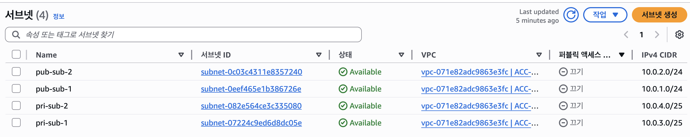
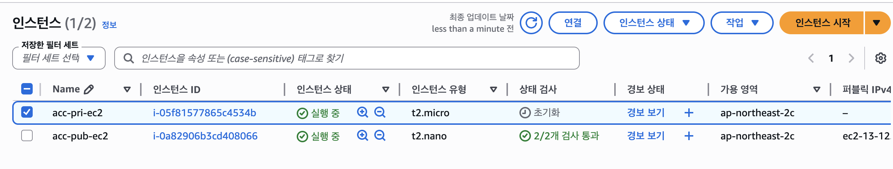
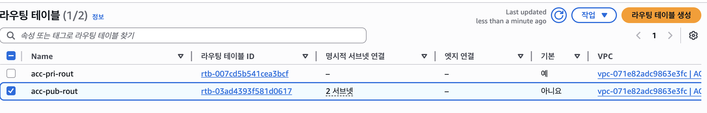

# VPC 및 Route 53

## Route53
- aws의 dns 서비스 
- dns + port 모니터링(health check) + l4(failover) + gslb(라우팅 정책, 네트워크에서 경로를 찾는 행위)
- 도메인을 타깃으로 한 분산 처리(로드밸런서와는 다름)
---
- route 53: 도메인 확인 ➡️ 로드밸런서: 프로토콜(tcp, udp), 포트 번호, 애플리케이션 정보(http, https) 확인
- 네임서버 : ip 주소와 도메인 네임을 연결해주는 역할을 함

### IP
- 인터넷에 연결되어 있는 모든 장치를 식별할 수 있도록 각 장비에 부여되는 고유 주소
- 네트워크 데이터가 우리한테 잘 도달할 수 있도록 하기 위해 우리가 가지고 있는 주소 정보
- 총 32비트로 이뤄짐 (IPv4): 255.255.255.255 (11111111.11111111.11111111.11111111)
- 분류
  - 고정 ip: 변하지 않는 IP
  - 유동 ip: 변경될 수 있는 IP
- 사용 범위
  - 공인 ip: 인터넷에서 사용하는 주소. 확인 방법: https://ip.pe.kr/
  - 사설 ip: 내부 네트워크에서 사용하는 주소. 확인 방법: ipconfig
- 공인 IP와 사설 IP 관계 예시
  - 이대와 Y대가 각각 내부 네트워크(사설 IP: 192.168.10.1 등)를 갖고 있지만, 외부 인터넷에는 하나의 공인 IP(128.15.15.15)를 통해 연결됨
  - 서로 다른 네트워크에서 동일한 사설 IP(192.168.10.1)가 존재할 수 있음

- DNS
    - domain name system
    - 도메인 이름(aws.amazon.com) > 네트워크 주소(192.168.1.0)로 변환 (Forwarding DNS)
    - reverse DNS ; 네트워크 주소 > 도메인 이름으로 변환
    - 분산형 데이터베이스 시스템
    - 분산형인 이유
        - Root DNS > TLD DNS > Authoritative DNS 순서로 질의하여 각 서버가 일부 정보만 담당하므로 전체가 분산 구조로 동작함
    - 통신 흐름
        - DHCP > ARP > DNS > TCP > HTTP/HTTPS
    - 도메인 계층 구조
        - .(루트) → 최상위도메인(TLD): 국가코드(.kr, .jp, .cn) / 일반(.com, .net, .biz) → 2단계(.co, .go, .or 또는 직접 선택) → 3단계(samsung.co.kr, president.go.kr 등)

- DNS 레코드
    - DNS 서버가 요청(Request)을 받았을 때 어떻게 응답할지 정의한 규칙
    - 기본 형식: RR(Name, Value, Type, TTL)
    - A, CNAME, NS, Alias
        - A ) 도메인 이름을 ipv4 주소에 매핑. 예: example.com → 192.168.1.10
        - CNAME ) 하나의 도메인 이름을 다른 도메인 이름에 매핑, 주로 서브도메인에 사용. 예: (www.movie.com, KOREA-CDN.movie.com, CNAME, 20)
        - NS ) 어떤 네임 서버가 권한을 관리하는지 나타내는 레코드
        - Alias ) Route53의 특수 레코드, 도메인 이름을 aws 리소스와 연결할 때 사용함
    - DNS 질의 흐름 예시 (testmapping.shop)
        - 클라이언트 → 로컬 네임서버: www.testmapping.shop의 IP 있니?
        - 로컬 네임서버 → 루트 네임서버: www.testmapping.shop의 IP 있니?
        - 루트 네임서버 → .com 네임서버 IP 반환 (A타입)
        - 로컬 네임서버 → .com 네임서버: www.testmapping.shop의 IP 있니?
        - .com 네임서버 → 가비아 네임서버(ns-89.awsdns-11.com) IP 반환 (A타입)
        - 로컬 네임서버 → 가비아 네임서버: www.testmapping.shop의 IP 있니?
        - 가비아 네임서버 → 13.124.120.181 반환 (A타입)
        - 최종적으로 클라이언트에게 IP 전달

### Route53 실습
- 호스팅 영역: 트래픽 라우팅 방식에 대한 레코드들의 저장소
- 실습 과정
    1. Route 53 > 호스팅 영역 생성
    2. 가비아에서 구매한 도메인(testmapping.shop) 입력
    3. 퍼블릭 호스팅 영역 선택 (인터넷에서 트래픽을 라우팅하는 방식 결정)
    4. 호스팅 영역 생성 시 NS, SOA 레코드가 자동 생성됨
    5. NS 레코드의 네임서버 값(ns-89.awsdns-11.com 등 4개)을 가비아 네임서버 설정에 등록
    6. A 레코드 생성: 레코드 이름 www, 값 EC2 public IP(13.124.120.181), TTL 60초, 단순 라우팅
    7. EC2 서버에 아파치 서버 설치 후 www.testmapping.shop 접속 확인
    8. 보안그룹에 SSH와 HTTP 인바운드 규칙 추가 필요

- aws 라우팅 정책
    - 단순 : 표준 DNS 기능을 사용함
    - 가중치 기반 : 각 리소스에 보낼 트래픽을 비율로 지정함
    - 지리적 위치 : 사용자의 위치에 기반하여 트래픽 라우팅
    - 지리적 근접 : 리소스 위치에 기반하여 트래픽 라우팅
    - 지연 시간 : 지연 시간이 가장 짧은 리전으로 트래픽 라우팅
    - 장애조치 : 정상 상태일때만 트래픽을 라우팅
    - 다중 응답 : 무작위로 트래픽 라우팅

# VPC

- CIDR
    - IP 주소 = 네트워크 id + 호스트 id(장치 식별)
        - 네트워크 ID: 네트워크를 구분하기 위한 부분. 수많은 호스트들을 효과적으로 관리하기 위해 크게 묶은 단위
        - 호스트 ID: 호스트를 개별적으로 관리하기 위해 사용되는 ID
    - classless inter-domain routing
    - 네트워크 ID & 호스트 ID 주소 범위를 구분하기 위한 표기법. AWS도 해당 표기법을 활용
    - 192.168.0.0/24 ⇒ 24개의 비트를 네트워크 id로 마스크하여 나머지 비트(8비트)를 host id로 사용함
    - 8개의 비트를 호스트ID로 활용하므로 총 256(2^8)개의 IP 주소 도출
    - aws에서는 16~28의 서브넷 마스크 범위만 허용함
    - 192.168.0.0을 Base IP, /24를 Subnet Mask라 함

- AWS 구조
    - 리전 ) 전세계에서 데이터센터를 클러스터링한 물리적 위치, 데이터센터를 지리적으로 나눈 단위
    - AZ(가용영역) ) 여러 데이터센터를 묶은 단위, AZ 여러개로 리전을 구성함
    - 예: 서울 리전 = AZ-a + AZ-b + AZ-c + AZ-d

### VPC

- VPC(Virtual Private Cloud)란 나만의 독립된 가상 네트워크망
- VPC 이전: 클라우드 리소스들을 격리할 방법이 없어 서로 복잡하게 연결되어 있었음. 시스템 복잡도 상승, 하나의 리소스를 추가하기 위해 모든 리소스 관계를 수정해야 하는 번거로움
- 2011년 VPC 도입: vpc 별로 네트워크 구성 가능, 독립적인 하나의 네트워크로 작동
- 시스템 의존도가 내려가며 유지보수의 편리성
- 리전당 5개 생성 가능 (리전 단위로 생성되며, 리전을 지정해 생성 가능)
- VPC당 5개의 CIDR 설정 가능
- 사설 IPv4 범위만 할당 가능
    - 다른 VPC끼리 cidr와 겹치면 안됨
    - 추후 추가될 VPC를 고려하여 `/28`로 설정하기를 권장
- 계정 생성시 default vpc 생성됨 (VPC 콘솔에서 확인 가능)

### 서브넷

- vpc의 ip 주소를 나눠 리소스를 배치하는 물리적 주소 범위
- ip주소의 논리적 영역을 쪼개 만든 하위 네트워크 망
    - ip 범위 안에서 서브넷의 ip 범위를 지정해야 함
- public과 private subnet이 존재함
- 서브넷 IP 범위 예시
    - VPC: 10.0.0.0/16 → 범위: 10.0.0.0 ~ 10.0.255.255
    - Public Subnet: 10.0.1.0/24 → 범위: 10.0.1.0 ~ 10.0.1.255
    - Private Subnet: 10.0.2.0/24 → 범위: 10.0.2.0 ~ 10.0.2.255

- VPC는 하나의 리전에 존재하는 것 처럼 서브넷은 하나의 AZ에만 존재함 > 고가용성을 위해 여러 AZ를 사용하는 것을 권장

- 왜 VPC를 분리(Subnetting)해서 사용해야 하는가?
    - ip 주소들을 낭비없이 효율적으로 사용하기 위해서
    - 보안 격리: public과 private을 분리하여 내부망을 사용 가능
    - 관리 용이성

### IGW (Internet Gateway)

- vpc 리소스를 인터넷과 연결하도록 허용하는 ec2 인스턴스 혹은 람다함수
- vpc는 기본적으로 격리된 네트워크 환경이므로, 리소스들은 기본적으로 인터넷과 연결되어있지 않음
- 인터넷으로 나가기 위한 통로
- IGW를 설정했다고 자동으로 인터넷과 연결되는 것은 아님
- IGW와 서브넷을 연결하는 과정이 추가적으로 필요함 → Routing Table 사용

### Route Table (라우팅 테이블)

- 서브넷 또는 게이트웨이의 네트워크 트래픽이 어디로 전송되어야 할지에 대한 라우팅 규칙을 포함한 테이블
- 트래픽이 어느 곳으로 가야하는지 알려주는 이정표 역할
- 서브넷에는 각각 라우트 테이블이 연결되어 있음
- public/private 여부를 결정하는 것이 바로 라우팅 테이블의 Target 설정
    - Public Subnet: Destination 0.0.0.0/0 → Target: IGW (인터넷 게이트웨이로 보냄)
    - Private Subnet: Destination 10.0.0.0/16 → Target: local (내부 통신만 지원)
- 트래픽 흐름: VPC 내부 리소스 → Route Table (Destination: 0.0.0.0/0, Target: IGW) → Internet Gateway → Internet
- 확인 방법
    - VPC > Subnet > 특정 Subnet 선택 후 라우팅 테이블 보기
    - VPC > 라우팅 테이블 > 라우팅 테이블 별로 연결된 Subnet 확인 가능

### Bastion Host & NAT Gateway

- private subnet 안에 있는 리소스들을 외부와 통신하기 위하여 사용
- 내부 > 외부, 외부 > 내부 방향의 차이가 있음
- 시나리오: Private Subnet에 RDS가 있고 중요한 사용자 정보가 저장되어 있어 내부망에서만 접근 가능하도록 했는데, RDS가 인터넷을 통해 업데이트가 필요한 경우

- NAT Gateway (내부 → 외부 방향)
    - 인터넷 접속이 가능한 public subnet에 NAT gateway를 설정해두고, private subnet이 외부 인터넷이 필요한 경우 NAT gateway를 거치도록 라우팅을 추가함
    - Private sub 리소스 > Public sub 내의 NAT gateway > IGW > 외부 연결 가능
    - 단방향성: 외부 → Private Subnet으로의 연결은 불가
    - 특정 AZ에만 생성되며 Elastic IP를 사용함
    - 여러 AZ에 각각 NAT Gateway를 생성하면 내결함성(Fault Tolerance)을 높일 수 있음 (AZ-A가 다운되어도 AZ-B의 Private Subnet 인스턴스는 영향 없음)
    - 비용은 시간당 사용 요금과 처리한 데이터양을 기준으로 책정됨
    - 시간당 비용도 발생하므로 장기간 사용 시 비용 부담이 커질 수 있음
    - 라우팅 테이블 설정: Private Subnet의 라우팅 테이블에 Destination 0.0.0.0/0, Target: NAT 게이트웨이 추가

- Bastion Host (외부 → 내부 방향)
    - Public Subnet에 위치해 외부에서 Private Subnet으로의 통신을 도와주는 대리인
    - 내외부 네트워크에서 일종의 게이트웨이 역할을 수행
    - EC2 Instance에 해당함
    - 사용을 위한 설정:
        1. Bastion Host Security Group: 인터넷에서 제한된 CIDR(외부)로부터 접근을 허용해야 함
        2. EC2 Security Group: Bastion Host의 보안 그룹 혹은 Bastion Host의 개인 IP에 대해 SSH 연결을 허용해야 함
    - SSH(Secure Shell): 원격 호스트에 접속하기 위해 사용되는 보안 프로토콜
    - 보안 그룹: 인스턴스 단위로 적용할 수 있는 네트워크 보안 기술. 인스턴스에 들어오고(인바운드) 나가는(아웃바운드) 트래픽 중 어떤 걸 허용할지 걸러주는 규칙 모음집

### NACL (Network Access Control List)

- 인스턴스별로 보안그룹을 설정할 수 있는데 서브넷 단위로 트래픽제어를 해주는 방화벽을 말함
- Subnet을 오고가는 모든 트래픽에 대해 허용(allow)하거나 거부(deny)하여 트래픽을 제어하는 역할
- 서브넷이 생성되면 자동으로 기본 NACL(Default NACL)에 연결됨
    - 기본 NACL은 사용 편의성을 위해 비교적 넓게 허용하는 규칙이 설정되어 있음
    - 외부 → Subnet(인바운드), Subnet → 외부(아웃바운드) 트래픽을 기본으로 허용
- 커스텀 NACL을 만드는 경우 인바운드와 아웃바운드 규칙이 모두 허용되지 않은 상태에서 시작
- NACL의 각 규칙에는 1 ~ 32766 사이의 번호를 부여하며, 이 번호로 우선순위를 결정
- 규칙 번호가 낮을수록 우선순위가 높고, 여러 규칙이 겹칠 경우 더 낮은 번호의 규칙이 먼저 적용됨
- 실무에서는 나중에 규칙을 추가하기 쉽도록 보통 100 단위로 띄워서 설정
- stateless (보안그룹은 stateful)

### Security Group vs NACL 비교

| 구분 | 보안 그룹 (Security Group) | NACL |
|---|---|---|
| 적용 단위 | 인스턴스 단위 | Subnet 단위 |
| 상태 관리 | Stateful: 트래픽 허용/거부 여부를 기억하여 응답 트래픽에 대한 평가 X | Stateless: 트래픽 허용 여부를 기억하지 않으므로 응답 트래픽도 허용 여부 확인 |
| 규칙 평가 | 모든 규칙이 평가되고 허용/거부 여부 결정 | 가장 높은 우선순위를 가진 규칙이 우선 평가되며, 첫 번째 비교로 허용/거부 결정 |
| 적용 범위 | EC2 인스턴스 하나에 적용 | Subnet 안에 있는 모든 EC2 인스턴스에 적용 |
| 규칙 종류 | 허용(Allow) 규칙만 설정 가능 | 허용(Allow), 거부(Deny) 규칙 모두 설정 가능 |

- 트래픽 흐름 (Incoming Request): NACL Inbound Rules → SG Inbound Rules → EC2 Instance → Outbound Allowed (Stateful, SG는 응답 자동 허용) → NACL Outbound Rules (Stateless, 다시 평가)
- 트래픽 흐름 (Outgoing Request): SG Outbound Rules → EC2 Instance → NACL Outbound Rules → ... → NACL Inbound Rules (Stateless) → Inbound Allowed (Stateful)

### VPC Peering

- 두 vpc를 연결하여 서로 통신하도록 함
    
    private ip주소를 사용하여 두 vpc간 트래픽을 라우팅할 수 있도록 하여 두 vpc간의 연결을 이루는 서비스
    
    인터넷을 거치지 않음 (비용 저렴하며 속도 빠름)
    
- AWS 네트워크를 통해 연결되므로 안전함
- 두 vpc의 cidr이 겹치면 안됨
- vpc 피어링은 전이되지 않음 > A-B, B-C 간 되어있어도 A-C는 통신할 수 없음 → A-C 간에도 별도로 피어링 설정 필요
- 피어링 활성화를 위하여 서브넷의 라우팅 테이블도 통신이 가능하도록 업데이트 해주어야 함
- 서로 다른 AWS 계정 및 리전에도 통신 가능함

### VPC Endpoint

- S3, CloudWatch, CloudFront, DynamoDB, API Gateway 등은 VPC 내부에 위치한 서비스가 아니라 별도의 public ip를 갖고 외부에서 접근하는 서비스임
    - private ec2 instance는 NAT(public sub) > IGW를 거쳐서 접근해야 함

- VPC Endpoint 없이 접근하는 경우 (Option 1)
    - Private Subnet의 EC2 → Public Subnet의 NAT Gateway → Internet Gateway → 인터넷 외부 → Amazon SNS 등에 액세스
    - 문제점:
        1. 비용 문제: NAT Gateway 통과 시 비용 발생
        2. 보안 문제: 내부 서비스의 데이터가 public하게 노출됨

- VPC Endpoint를 사용하는 경우 (Option 2)
    - VPC 엔드포인트를 VPC 내부에 설정하면 AWS 내부 네트워크를 이용해 바로 연결이 가능함
    - Private Subnet의 EC2 → VPC Endpoint → Amazon SNS (인터넷을 거치지 않음)

### 실습 캡처 자료

